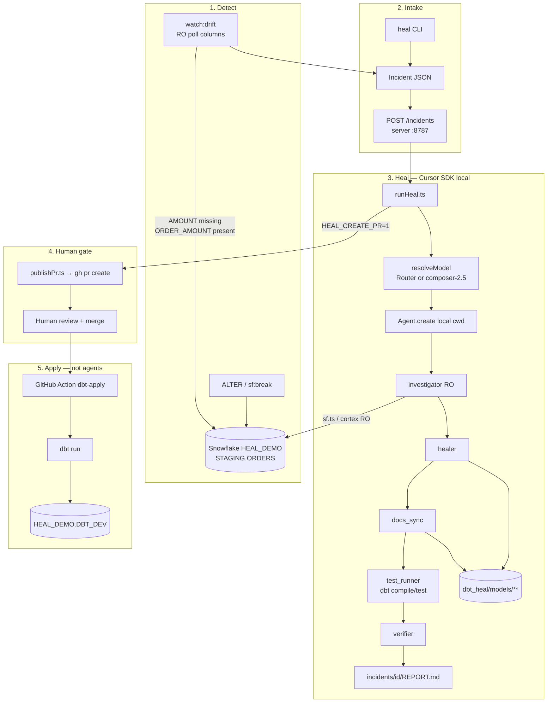
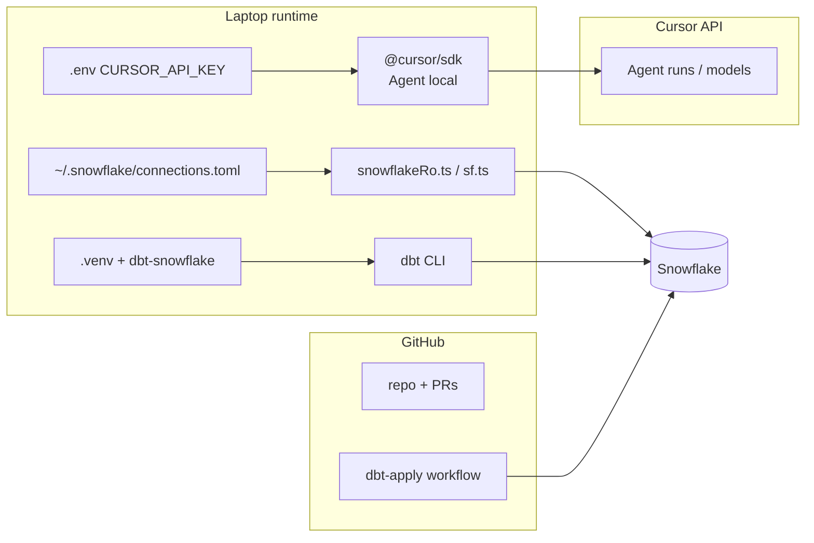

# Self-Healing Snowflake + dbt Pipeline (Cursor SDK Prototype)

Enterprise SDLC demo (**incident response on a data platform**): detect a broken **dbt** orders mart on Snowflake → multi-agent investigate (**RO**) → heal **`dbt_heal/models`** (SQL + tests + docs) → optional **GitHub PR** → human merge → CI **`dbt run`** into `HEAL_DEMO.DBT_DEV`.

**Closed loop, not self-deploying.** Agents never DDL/DML prod Snowflake; humans/CI apply.

**Runtime: local Cursor SDK only.** Cloud agents are a poor fit here (no `connections.toml`/PAT, no local dbt venv, Cortex headless blocked on trial).

---

## Architecture

### Closed loop



### Policy boundaries

```text
Snowflake  ──RO──►  agents (investigate / verify)
Git        ◄──W──  healer / docs_sync
PR merge   ──human approve──
dbt run    ──CI / human──►  Snowflake DBT_DEV
```

### Runtime / control plane



### Multi-agent order (mandatory)

| # | Agent | Writes | Reads |
|---|--------|--------|--------|
| 1 | **investigator** | notes only | Snowflake RO, contract |
| 2 | **healer** | `dbt_heal/models/**/*.sql` | investigator findings |
| 3 | **docs_sync** | yml tests/docs | healed SQL + live columns |
| 4 | **test_runner** | none | `dbt compile` / `dbt test` |
| 5 | **verifier** | `REPORT.md` | RO + dbt results |

Orchestrated by `src/runHeal.ts` + `src/prompts.ts`. Agent defs: `.cursor/agents/`.

### Failure surfaces

| Path | Detector | Heal entry | Auto PR / CI |
|------|----------|------------|--------------|
| **Schema drift** | `watch:drift` or `sf:break` / ALTER | `demo:heal` or POST `/incidents` | `HEAL_CREATE_PR=1` → merge → `dbt-apply` |
| **Compile fail** | `demo:break-compile` | `demo:heal:compile` | optional `--create-pr` |
| **Duplicate tests** | `sf:break-dup` | `demo:heal:dup` | optional `--create-pr` |

Only the **amount → order_amount** rename is auto-watched today. Compile / dup share the same heal → PR → apply spine via explicit break + heal.

---

## Prerequisites (Day 0)

1. Node.js ≥ 22.13 + `CURSOR_API_KEY` in `.env`
2. Snowflake connection in `~/.snowflake/connections.toml`
3. Python venv + dbt-snowflake — see [`docs/DBT_SETUP.md`](docs/DBT_SETUP.md)
4. Optional: Cortex CLI (`src/sf.ts` is the RO fallback on trial)
5. For PR + CI apply: `gh auth login` + repo secrets (`SNOWFLAKE_*`)

```bash
cp .env.example .env   # CURSOR_API_KEY=
npm install
python3 -m venv .venv && source .venv/bin/activate
pip install 'dbt-snowflake>=1.8,<1.11'
npm run dbt:profile    # writes gitignored dbt_heal/profiles.yml
npm run preflight
npm run demo:reset     # seed + dbt build (green) — models must use amount
npm run models         # Router vs fallback
```

---

## Showcase demo (~20 min)

Full guide: [`docs/DEMO_PATHS.md`](docs/DEMO_PATHS.md).

### Core path — ALTER → heal → PR → deploy

```bash
# Every terminal: load nvm if needed
export NVM_DIR="$HOME/.nvm" && . "$NVM_DIR/nvm.sh"

# Green baseline (AMOUNT in Snowflake + amount in dbt models)
npm run demo:reset

# T1 — heal webhook with auto-PR
HEAL_CREATE_PR=1 npm run server

# T2 — fresh watcher (restart if previously fired)
npm run watch:drift -- --interval 10
```

In **Snowsight**:

```sql
ALTER TABLE HEAL_DEMO.STAGING.ORDERS
  RENAME COLUMN amount TO order_amount;
```

Then: show T2 `DRIFT detected` → T1 multi-agent stream → open the GitHub PR → **merge** → Actions **dbt-apply** → prove deploy:

```sql
SELECT GET_DDL('VIEW', 'HEAL_DEMO.DBT_DEV.STG_ORDERS');
-- expect order_amount
```

### Manual / flash paths

```bash
npm run demo:paths -- list
npm run demo:heal              # drift (CLI, no watcher)
npm run demo:heal:compile      # compile-fail
npm run demo:heal:dup          # duplicate unique tests
npm run demo:blast-block       # live-extend: blast-radius gate
```

---

## Usage (operators)

```bash
npm run preflight
npm run demo:reset
npm run sf:break               # or ALTER in Snowsight
npm run demo:heal
npm run heal:pr -- --incident <id>   # if PR not auto-created

npm run demo:heal:dry          # investigate only
npm run heal:resume -- --incident fixtures/incidents/schema-drift.json
```

Webhook without watcher: `npm run server` then `POST /incidents` (add `?create_pr=1` or `HEAL_CREATE_PR=1`).

---

## Local vs cloud

| Need | Local | Cloud agent |
|------|-------|-------------|
| Snowflake PAT / connections.toml | Yes | Needs injected secrets |
| dbt venv | Yes | Must bake into image |
| Cortex `-p` on trial | Blocked → use `sf.ts` | Same + install cost |
| Interview reliability | High | Fragile |

Use **local**. Cloud is a future evolution with self-hosted runners + secret injection.

---

## Layout

| Path | Purpose |
|------|---------|
| `dbt_heal/` | dbt project (heal target: models + tests + docs) |
| `pipeline/contract.yaml` | Thin pointer + blast_radius |
| `src/heal.ts` / `runHeal.ts` | CLI + SDK heal orchestrator |
| `src/server.ts` | Incident webhook |
| `src/watchDrift.ts` | Auto-detect amount → order_amount |
| `src/publishPr.ts` | Commit models + open GitHub PR |
| `src/sf.ts` | RO Snowflake + seed/break |
| `src/blastRadius.ts` | Pre-heal gate / live-extend |
| `.github/workflows/dbt-apply.yml` | Post-merge `dbt run` |
| `.cursor/agents/` | investigator, healer, docs_sync, test_runner, verifier |
| `fixtures/snowflake/` | seed / break / verify |
| `docs/DEMO_PATHS.md` | Three failure-mode runbooks |

---

## Out of scope

- Cloud SDK heal loop
- Auto `DEPLOY` / unsupervised prod DDL
- Generic DDL watcher (any column / drop / type change)
- dbt Cloud / package mesh
- Slack as required path (notifier stub only)
